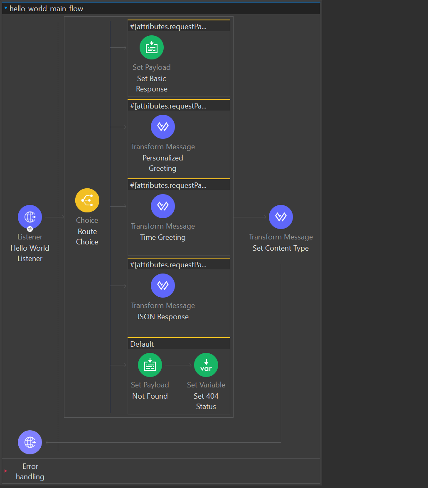

# Hello World Mule Application

## Overview
A simple REST API built with MuleSoft that demonstrates basic flow concepts, HTTP listener configuration, and message transformation.

## Features
- **GET /hello** - Returns a simple "Hello World" message
- **GET /hello/{name}** - Returns a personalized greeting
- **GET /hello/time** - Returns current timestamp with greeting
- **POST /hello** - Accepts JSON payload and returns formatted response

## Prerequisites
- Anypoint Studio 7.x or later
- Java 8 or later
- Basic understanding of REST APIs

## Project Structure
```
hello-world-mule-app/
├── src/main/mule/
│   └── hello-world-flow.xml          # Main flow configuration
├── src/main/resources/
│   ├── application.yaml              # Configuration properties
│   └── log4j2.xml                   # Logging configuration
├── src/test/munit/
│   └── hello-world-flow-test.xml     # Unit tests
├── pom.xml                           # Maven dependencies
└── mule-artifact.json               # Mule app descriptor
```
## Flow


## API Endpoints

### 1. Basic Hello World
```
GET http://localhost:8081/hello
Response: "Hello World from MuleSoft!"
```

### 2. Personalized Greeting
```
GET http://localhost:8081/hello/John
Response: "Hello John! Welcome to MuleSoft."
```

### 3. Time-based Greeting
```
GET http://localhost:8081/hello/time
Response: "Hello! Current time is: 2024-01-15T10:30:45"
```

### 4. POST with JSON
```
POST http://localhost:8081/hello
Content-Type: application/json

{
  "name": "Alice",
  "language": "English"
}

Response: 
{
  "message": "Hello Alice!",
  "language": "English",
  "timestamp": "2024-01-15T10:30:45"
}
```

## Setup Instructions

### 1. Create New Project
1. Open Anypoint Studio
2. File → New → Mule Project
3. Project Name: `hello-world-mule-app`
4. Runtime Version: Mule 4.x
5. Click Finish

### 2. Configure Application Properties
Create `src/main/resources/application.yaml`:
```yaml
http:
  port: 8081
  host: localhost

app:
  name: "Hello World Mule App"
  version: "1.0.0"
```

### 3. Implementation Steps

#### Step 1: Add HTTP Listener
- Drag HTTP → Listener from Mule Palette
- Configure:
  - Display Name: "Hello World Listener"
  - Path: `/hello/*`
  - Allowed Methods: GET, POST

#### Step 2: Add Choice Router
- Add Choice router after HTTP Listener
- Configure routing based on HTTP method and path

#### Step 3: Add Transform Components
- Add Transform Message components for each route
- Configure DataWeave expressions for responses

#### Step 4: Configure Global HTTP Configuration
- Create HTTP Listener config
- Host: `${http.host}`
- Port: `${http.port}`

## Flow Configuration (XML)

```xml
<?xml version="1.0" encoding="UTF-8"?>
<mule xmlns:http="http://www.mulesoft.org/schema/mule/http"
      xmlns:ee="http://www.mulesoft.org/schema/mule/ee/core"
      xmlns="http://www.mulesoft.org/schema/mule/core"
      xmlns:doc="http://www.mulesoft.org/schema/mule/documentation"
      xmlns:xsi="http://www.w3.org/2001/XMLSchema-instance"
      xsi:schemaLocation="http://www.mulesoft.org/schema/mule/http http://www.mulesoft.org/schema/mule/http/current/mule-http.xsd
                          http://www.mulesoft.org/schema/mule/ee/core http://www.mulesoft.org/schema/mule/ee/core/current/mule-ee.xsd
                          http://www.mulesoft.org/schema/mule/core http://www.mulesoft.org/schema/mule/core/current/mule.xsd">

    <http:listener-config name="HTTP_Listener_config" doc:name="HTTP Listener config">
        <http:listener-connection host="${http.host}" port="${http.port}"/>
    </http:listener-config>

    <flow name="hello-world-main-flow" doc:name="hello-world-main-flow">
        <http:listener doc:name="Hello World Listener" 
                      config-ref="HTTP_Listener_config" 
                      path="/hello/*" 
                      allowedMethods="GET,POST"/>
        
        <choice doc:name="Route Choice">
            <!-- Basic Hello World -->
            <when expression='#[attributes.requestPath == "/hello" and attributes.method == "GET"]'>
                <set-payload value="Hello World from MuleSoft!" doc:name="Set Basic Response"/>
            </when>
            
            <!-- Personalized Greeting -->
            <when expression='#[attributes.requestPath matches "/hello/[^/]+" and attributes.method == "GET" and not (attributes.requestPath contains "time")]'>
                <ee:transform doc:name="Personalized Greeting">
                    <ee:message>
                        <ee:set-payload><![CDATA[%dw 2.0
output application/json
var name = (attributes.requestPath splitBy "/")[2]
---
"Hello " ++ name ++ "! Welcome to MuleSoft."]]></ee:set-payload>
                    </ee:message>
                </ee:transform>
            </when>
            
            <!-- Time-based Greeting -->
            <when expression='#[attributes.requestPath == "/hello/time" and attributes.method == "GET"]'>
                <ee:transform doc:name="Time Greeting">
                    <ee:message>
                        <ee:set-payload><![CDATA[%dw 2.0
output application/json
---
"Hello! Current time is: " ++ (now() as String {format: "yyyy-MM-dd'T'HH:mm:ss"})]]></ee:set-payload>
                    </ee:message>
                </ee:transform>
            </when>
            
            <!-- POST with JSON -->
            <when expression='#[attributes.requestPath == "/hello" and attributes.method == "POST"]'>
                <ee:transform doc:name="JSON Response">
                    <ee:message>
                        <ee:set-payload><![CDATA[%dw 2.0
output application/json
---
{
    message: "Hello " ++ (payload.name default "Guest") ++ "!",
    language: payload.language default "English",
    timestamp: now() as String {format: "yyyy-MM-dd'T'HH:mm:ss"}
}]]></ee:set-payload>
                    </ee:message>
                </ee:transform>
            </when>
            
            <!-- Default case -->
            <otherwise>
                <set-payload value='{"error": "Endpoint not found"}' doc:name="Not Found"/>
                <set-variable variableName="httpStatus" value="404" doc:name="Set 404 Status"/>
            </otherwise>
        </choice>
        
        <ee:transform doc:name="Set Content Type">
            <ee:message>
                <ee:set-attributes><![CDATA[%dw 2.0
output application/java
---
{
    headers: {
        "Content-Type": "application/json"
    },
    statusCode: vars.httpStatus default 200
}]]></ee:set-attributes>
            </ee:message>
        </ee:transform>
    </flow>
</mule>
```


## Testing the Application

### 1. Run the Application
- Right-click project → Run As → Mule Application
- Wait for "DEPLOYED" message in console
- Application runs on http://localhost:8081

### 2. Test with Postman or cURL

**Basic Hello:**
```bash
curl http://localhost:8081/hello
```

**Personalized Greeting:**
```bash
curl http://localhost:8081/hello/John
```

**Time Greeting:**
```bash
curl http://localhost:8081/hello/time
```

**POST Request:**
```bash
curl -X POST http://localhost:8081/hello \
  -H "Content-Type: application/json" \
  -d '{"name": "Alice", "language": "Spanish"}'
```

## Key Learning Points

### Studio Navigation
- **Package Explorer** - Navigate project files
- **Canvas** - Visual flow designer
- **Mule Palette** - Drag components to canvas
- **Properties Panel** - Configure selected components
- **Console** - View application logs and deployment status

### Flow Concepts
- **Source** - Flow trigger (HTTP Listener)
- **Processors** - Components that process messages
- **Message Structure** - Payload, attributes, variables
- **DataWeave** - MuleSoft's transformation language

### Best Practices Demonstrated
1. **Configuration Externalization** - Using application.yaml
2. **Descriptive Naming** - Clear component names
3. **Error Handling** - Default case in choice router
4. **Content Type Management** - Proper HTTP headers
5. **Documentation** - Component descriptions

## Troubleshooting

### Common Issues
1. **Port Already in Use** - Change port in application.yaml
2. **Application Not Starting** - Check console for errors
3. **404 Errors** - Verify path configuration in HTTP Listener
4. **JSON Parsing Errors** - Validate JSON payload format

### Debug Tips
- Use Debug Mode (right-click → Debug As → Mule Application)
- Add breakpoints in flows
- Check Variables and Payload in Debug perspective
- Monitor Console output for detailed logs

