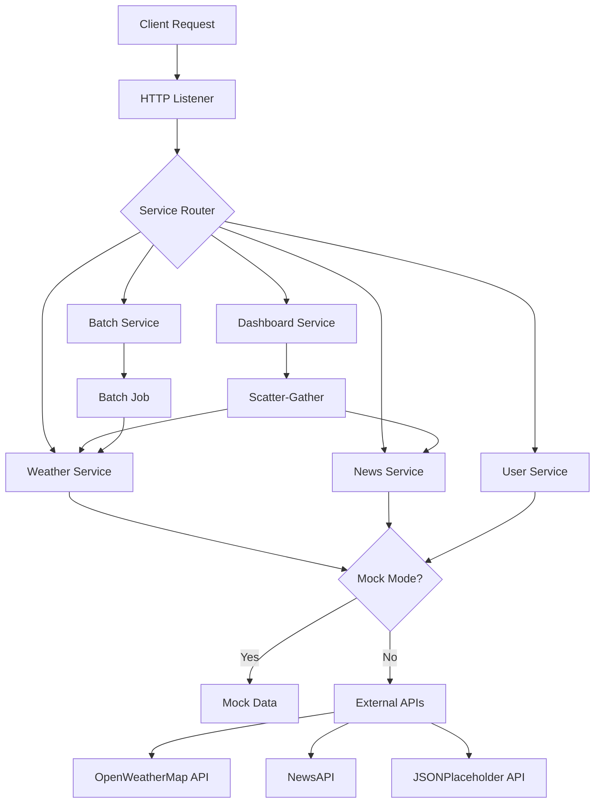

# Weather & News Aggregator - MuleSoft Project

[](https://www.mulesoft.com/)
[](LICENSE)
[](README.md)

## 📋 Project Overview

The **Weather & News Aggregator** is an advanced MuleSoft application that demonstrates comprehensive REST API consumption patterns by integrating multiple external services into a unified platform. This project showcases enterprise-level integration patterns including batch processing, error handling, mock services, and real-time data aggregation.

### 🎯 Key Features

| Feature | Description | Implementation |
|---------|-------------|----------------|
| **Multi-API Integration** | Weather, News, and User services | OpenWeatherMap, NewsAPI, JSONPlaceholder |
| **Batch Processing** | Bulk weather data retrieval | Mule Batch Jobs with parallel processing |
| **Mock Services** | Development without external dependencies | Local JSON mock data |
| **Dashboard Aggregation** | Combined data from multiple sources | Scatter-Gather pattern |
| **Error Handling** | Resilient service integration | Comprehensive error management |
| **Data Transformation** | Complex data mapping and enrichment | Advanced DataWeave transformations |

### 🏗️ Architecture Overview



## 🚀 Quick Start

### Prerequisites

| Requirement | Version | Download Link |
|-------------|---------|---------------|
| Anypoint Studio | 7.x+ | [Download](https://www.mulesoft.com/platform/studio) |
| Java JDK | 8+ | [Download](https://adoptopenjdk.net/) |
| Maven | 3.6+ | [Download](https://maven.apache.org/) |

### API Keys (Optional for Production)

| Service | Free Tier | Sign Up Link |
|---------|-----------|--------------|
| OpenWeatherMap | 1000 calls/day | [Get API Key](https://openweathermap.org/api) |
| NewsAPI | 1000 requests/day | [Get API Key](https://newsapi.org/) |

## 📁 Project Structure

```
weather-news-aggregator/
├── 📂 src/main/mule/
│   ├── 🔧 global-config.xml              # HTTP configurations
│   ├── 🌤️ weather-service.xml           # Weather API integration
│   ├── 📰 news-service.xml               # News API integration
│   ├── 👤 user-service.xml               # User API integration
│   ├── 📊 dashboard-service.xml          # Data aggregation
│   ├── ⚡ batch-processing.xml           # Bulk operations
│   ├── 🔌 api-consumer-main.xml          # Main endpoints
│   └── 🎭 mock-services.xml              # Mock implementations
├── 📂 src/main/resources/
│   ├── ⚙️ application.yaml               # App configuration
│   ├── 🔒 secure.yaml                    # API keys (optional)
│   ├── 📂 mock-data/
│   │   ├── weather-mock.json
│   │   ├── news-mock.json
│   │   └── users-mock.json
│   └── 📂 api-specs/
│       └── weather-news-api.raml
├── 📂 src/test/munit/
│   ├── weather-service-test.xml
│   ├── news-service-test.xml
│   └── dashboard-service-test.xml
└── 📄 pom.xml                            # Maven dependencies
```

## 🛠️ Installation & Setup

### Step 1: Clone and Import

```bash
# Clone the project (if from repository)
git clone <repository-url>
cd weather-news-aggregator

# Or create new Mule project in Anypoint Studio
File → New → Mule Project
Project Name: weather-news-aggregator
Runtime: Mule 4.x
```

### Step 2: Configure Dependencies

Update `pom.xml`:

```xml
<dependencies>
    <!-- HTTP Connector -->
    <dependency>
        <groupId>org.mule.connectors</groupId>
        <artifactId>mule-http-connector</artifactId>
        <version>1.6.0</version>
        <classifier>mule-plugin</classifier>
    </dependency>
    
    <!-- JSON Module -->
    <dependency>
        <groupId>org.mule.modules</groupId>
        <artifactId>mule-json-module</artifactId>
        <version>2.3.1</version>
        <classifier>mule-plugin</classifier>
    </dependency>
    
    <!-- Validation Module -->
    <dependency>
        <groupId>org.mule.modules</groupId>
        <artifactId>mule-validation-module</artifactId>
        <version>2.0.3</version>
        <classifier>mule-plugin</classifier>
    </dependency>
    
    <!-- MUnit Testing -->
    <dependency>
        <groupId>com.mulesoft.munit</groupId>
        <artifactId>munit-runner</artifactId>
        <version>2.3.4</version>
        <classifier>mule-plugin</classifier>
        <scope>test</scope>
    </dependency>
</dependencies>
```

### Step 3: Application Configuration

Create `src/main/resources/application.yaml`:

```yaml
# Application Settings
app:
  name: "Weather News Aggregator"
  version: "1.0.0"
  enableMockMode: true  # Switch to false for production

# Server Configuration
http:
  listener:
    host: "0.0.0.0"
    port: 8081

# External API Configurations
apis:
  openweather:
    host: "api.openweathermap.org"
    port: 443
    protocol: "HTTPS"
    basePath: "/data/2.5"
    apiKey: "${secure::openweather.api.key}"
    timeout: 30000
    
  newsapi:
    host: "newsapi.org"
    port: 443
    protocol: "HTTPS"
    basePath: "/v2"
    apiKey: "${secure::newsapi.key}"
    timeout: 30000
    
  jsonplaceholder:
    host: "jsonplaceholder.typicode.com"
    port: 443
    protocol: "HTTPS"
    basePath: ""
    timeout: 15000

# Performance Settings
batch:
  maxConcurrency: 5
  timeout: 60000

cache:
  weather:
    ttl: 600    # 10 minutes
  news:
    ttl: 1800   # 30 minutes

# Logging
logging:
  level: INFO
  pattern: "%d{HH:mm:ss.SSS} [%thread] %-5level %logger{36} - %msg%n"
```

## 🔌 API Endpoints

### Core Services

| Endpoint | Method | Description | Example |
|----------|--------|-------------|---------|
| `/weather/{city}` | GET | Weather data for city | `GET /weather/london` |
| `/news/{category}` | GET | News by category | `GET /news/technology` |
| `/users/{id}` | GET | User profile data | `GET /users/1` |
| `/dashboard/{city}/{category}` | GET | Combined dashboard | `GET /dashboard/paris/business` |
| `/weather/batch` | POST | Bulk weather processing | See example below |

### Utility Endpoints

| Endpoint | Method | Description |
|----------|--------|-------------|
| `/health` | GET | Application health check |
| `/api/docs` | GET | API documentation |
| `/` | GET | Welcome message |

## 📊 Usage Examples

### Weather Service

```bash
curl "http://localhost:8081/weather/tokyo"
```

**Response:**
```json
{
  "status": "success",
  "service": "weather",
  "city": "tokyo",
  "timestamp": "2024-01-15T14:30:00Z",
  "data": {
    "temperature": {
      "current": 18.5,
      "feelsLike": 17.2,
      "min": 15.1,
      "max": 21.3,
      "unit": "celsius"
    },
    "weather": {
      "main": "Clear",
      "description": "clear sky",
      "icon": "01d"
    },
    "atmosphere": {
      "pressure": 1013,
      "humidity": 45
    },
    "wind": {
      "speed": 2.1,
      "direction": 90
    },
    "location": {
      "name": "Tokyo",
      "country": "JP"
    }
  },
  "mockMode": true
}
```

### News Service

```bash
curl "http://localhost:8081/news/technology"
```

### Dashboard Service

```bash
curl "http://localhost:8081/dashboard/london/technology"
```

**Response:**
```json
{
  "status": "success",
  "service": "dashboard",
  "timestamp": "2024-01-15T14:30:00Z",
  "location": {
    "city": "london",
    "newsCategory": "technology"
  },
  "data": {
    "weather": { /* weather data */ },
    "news": {
      "category": "technology",
      "articles": [ /* top 5 articles */ ],
      "totalAvailable": 50
    },
    "summary": {
      "temperature": "18.5°C",
      "weatherCondition": "clear sky",
      "topNewsTitle": "Latest Technology Breakthrough",
      "newsCount": 5
    }
  },
  "metadata": {
    "weatherSource": "mock",
    "newsSource": "mock",
    "generatedAt": "2024-01-15T14:30:00Z"
  }
}
```

### Batch Processing

```bash
curl -X POST "http://localhost:8081/weather/batch" \
     -H "Content-Type: application/json" \
     -d '{
       "cities": ["london", "paris", "tokyo", "new york", "sydney"]
     }'
```

**Response:**
```json
{
  "status": "completed",
  "requestId": "550e8400-e29b-41d4-a716-446655440000",
  "summary": {
    "totalCities": 5,
    "successful": 5,
    "failed": 0,
    "processingTime": "PT3.245S"
  },
  "results": [
    {
      "city": "london",
      "status": "success",
      "data": { /* weather data */ },
      "timestamp": "2024-01-15T14:30:00Z"
    }
    // ... more results
  ],
  "timestamp": "2024-01-15T14:30:00Z"
}
```

## 🧪 Testing

### Running Tests

```bash
# Run all MUnit tests
mvn clean test

# Run specific test suite
mvn test -Dtest=weather-service-test
```

### Manual Testing Checklist

- [ ] Health check returns 200 OK
- [ ] Weather service responds for valid cities
- [ ] News service returns articles by category
- [ ] User service retrieves profile data
- [ ] Dashboard combines weather and news data
- [ ] Batch processing handles multiple cities
- [ ] Error handling works for invalid inputs
- [ ] Mock mode can be toggled

## 🔧 Configuration

### Mock Mode vs Production Mode

| Mode | Configuration | Use Case |
|------|---------------|----------|
| **Mock Mode** | `app.enableMockMode: true` | Development, testing, demo |
| **Production Mode** | `app.enableMockMode: false` | Live data, requires API keys |

### Setting up API Keys

Create `src/main/resources/secure.yaml`:

```yaml
secure:
  openweather:
    api:
      key: "your_openweathermap_api_key"
  newsapi:
    key: "your_newsapi_key"
```

## 🏗️ Architecture Details

### Design Patterns Implemented

| Pattern | Usage | Benefit |
|---------|-------|---------|
| **Scatter-Gather** | Dashboard service | Parallel API calls for faster response |
| **Batch Processing** | Weather bulk operations | Efficient handling of multiple requests |
| **Circuit Breaker** | Error handling | Service resilience |
| **Mock Service** | Development | Independent testing environment |
| **Request-Response** | All API calls | Standard HTTP communication |

### Data Flow

1. **Request Reception**: HTTP listener receives client request
2. **Service Routing**: Router directs to appropriate service flow
3. **Mode Detection**: Check if mock or production mode
4. **API Interaction**: Call external APIs or return mock data
5. **Data Transformation**: DataWeave transforms response format
6. **Response Delivery**: Formatted JSON response to client

### Error Handling Strategy

```xml
<!-- Example Error Handler -->
<error-handler>
    <on-error-continue type="HTTP:TIMEOUT">
        <!-- Handle timeout scenarios -->
    </on-error-continue>
    <on-error-continue type="HTTP:CONNECTIVITY">
        <!-- Handle connection issues -->
    </on-error-continue>
    <on-error-continue type="ANY">
        <!-- Handle all other errors -->
    </on-error-continue>
</error-handler>
```

## 📈 Performance Considerations

### Optimization Features

| Feature | Implementation | Impact |
|---------|----------------|--------|
| **Connection Pooling** | HTTP connector configuration | Improved throughput |
| **Timeout Management** | Service-specific timeouts | Better resource management |
| **Batch Processing** | Concurrent record processing | Bulk operation efficiency |
| **Caching** | Response caching (configurable) | Reduced API calls |

### Monitoring & Logging

- **Request/Response Logging**: All API interactions logged
- **Performance Metrics**: Processing time tracking
- **Error Tracking**: Detailed error information
- **Health Monitoring**: Application status endpoints

## 🚀 Deployment

### Local Development

```bash
# Start application
Right-click project → Run As → Mule Application

# Verify deployment
curl http://localhost:8081/health
```

### Production Deployment

1. **Package Application**:
   ```bash
   mvn clean package
   ```

2. **Deploy to Runtime**:
   - CloudHub deployment
   - On-premises runtime
   - Anypoint Runtime Fabric

3. **Environment Configuration**:
   - Update `application.yaml` for production
   - Configure secure properties
   - Set up monitoring and alerts

## 🔒 Security

### Best Practices Implemented

- **Secure Property Encryption**: API keys stored securely
- **HTTPS Communication**: All external API calls use HTTPS
- **Input Validation**: Request parameters validated
- **Error Message Sanitization**: No sensitive data in error responses

## 🤝 Contributing

### Development Guidelines

1. **Code Standards**: Follow MuleSoft best practices
2. **Testing**: Write MUnit tests for new features
3. **Documentation**: Update README for changes
4. **Error Handling**: Implement comprehensive error management

### Pull Request Process

1. Fork the repository
2. Create feature branch
3. Implement changes with tests
4. Update documentation
5. Submit pull request

## 📚 Learning Outcomes

After completing this project, you will understand:

- ✅ **Multi-API Integration**: Consuming different REST APIs
- ✅ **Batch Processing**: Handling bulk operations efficiently
- ✅ **Error Handling**: Building resilient integrations
- ✅ **Data Transformation**: Complex DataWeave operations
- ✅ **Mock Services**: Development and testing strategies
- ✅ **Scatter-Gather Pattern**: Parallel processing implementation
- ✅ **Production Deployment**: Real-world application deployment

## 🆘 Troubleshooting

### Common Issues

| Issue | Cause | Solution |
|-------|-------|----------|
| **Port already in use** | Another application using port 8081 | Change port in `application.yaml` |
| **API key errors** | Invalid or missing API keys | Check `secure.yaml` configuration |
| **Connection timeouts** | Network or service issues | Increase timeout values |
| **JSON parsing errors** | Invalid response format | Check mock data format |

### Debug Tips

- **Enable DEBUG logging**: Set `logging.level: DEBUG`
- **Check HTTP requests**: Use Postman or curl for testing
- **Validate mock data**: Ensure JSON format is correct
- **Monitor console output**: Watch for deployment errors

## 📄 License

This project is licensed under the MIT License - see the [LICENSE](LICENSE) file for details.

## 🔗 Additional Resources

- [MuleSoft Documentation](https://docs.mulesoft.com/)
- [DataWeave Reference](https://docs.mulesoft.com/dataweave/)
- [HTTP Connector Guide](https://docs.mulesoft.com/connectors/http/http-connector)
- [Batch Processing](https://docs.mulesoft.com/mule-runtime/4.4/batch-processing-concept)
- [OpenWeatherMap API](https://openweathermap.org/api)
- [NewsAPI Documentation](https://newsapi.org/docs)

---

**Built with ❤️ using MuleSoft Anypoint Platform**

*For support or questions, please open an issue or contact the development team.*